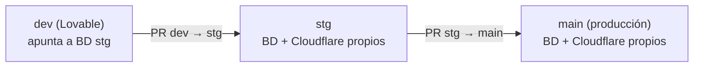

Con el setup ya hecho ([Supabase](/docs/lovable-setup/supabase-setup), [Cloudflare](/docs/lovable-ops/cloudflare-deploy), [dominio](/docs/lovable-ops/custom-domain)), este es el flujo que se repite en cada release. No se usa el botón Publish de Lovable en ningún punto — todo el despliegue pasa por PRs de GitHub.

## Resumen del flujo



---

## 1) Desarrollo (en `dev`, contra la base de datos de `stg`)

- Hacer cambios normalmente en Lovable, sobre la rama `dev`.
- Como `dev` apunta a la base de datos de `stg`, ya estás probando contra datos/esquema reales de staging.

Checklist rápida:

- [ ] Pantallas críticas cargan y navegan bien
- [ ] El inicio de sesión funciona (si aplica)
- [ ] Los flujos principales funcionan de punta a punta (frontend → backend)
- [ ] No se ven errores evidentes

---

## 2) Desplegar a staging: PR `dev → stg`

1. Abrir el PR **`dev → stg`** en GitHub.
2. Si el PR incluye migraciones nuevas, Supabase las aplica automáticamente al branch `stg` y comenta el resultado en el PR — confirma que sea exitoso antes de seguir.
3. Cloudflare genera una preview del proyecto `<proyecto>-stg` para ese PR — revísala.
4. Mergear el PR.
5. El merge dispara el deploy automático a `stg` (Cloudflare) y deja la migración aplicada en la base de datos de `stg`.
6. Si el PR incluye cambios en `supabase/functions/`, desplegarlos manualmente contra el `project-ref` de `stg` (esto **no** ocurre solo — ver [Cómo se despliegan las Edge Functions](/docs/lovable-setup/supabase-setup)):
   ```bash
   supabase functions deploy <nombre-de-la-function> --project-ref <project-ref-de-stg>
   ```

### Validación en `stg`

Antes de pasar a producción, probar en el subdominio propio de `stg` (ej. `stg.cliente.avilatek.net`):

- [ ] Login / registro (si aplica)
- [ ] Flujos principales (los más importantes del producto)
- [ ] Un caso de error típico se ve “bien” (mensaje claro, sin pantalla en blanco)

---

## 3) Desplegar a producción: PR `stg → main`

Antes de abrir el PR, revisar:

#### Backend (Supabase `main`)

- [ ] Secrets/credenciales de integraciones configurados en el proyecto de producción (Stripe, PostHog, etc. — recuerda que no se comparten con `stg`)
- [ ] Si el cambio puede borrar/modificar datos existentes: tener claro el paso manual (si aplica) y quién lo ejecuta

#### Frontend (Cloudflare `<proyecto>-prod`)

- [ ] Variables de entorno apuntan a las credenciales de **producción** (no las de `stg`)
- [ ] No hay secretos privados en variables del frontend

#### Cambios sensibles

- [ ] Evitar cambios "rompedores" en un solo paso — preferir un release en 2 pasos si el cambio es grande (primero backend compatible, luego lo demás)

### Publicar

1. Abrir el PR **`stg → main`**.
2. Confirmar que la migración (si aplica) se aplicó correctamente a producción según el comentario de Supabase en el PR.
3. Revisar la preview generada por Cloudflare en el proyecto `<proyecto>-prod`.
4. Mergear el PR.
5. El merge dispara el deploy automático a producción.
6. Si el PR incluye cambios en `supabase/functions/`, desplegarlos manualmente contra el `project-ref` de producción:
   ```bash
   supabase functions deploy <nombre-de-la-function> --project-ref <project-ref-de-main>
   ```

---

## 4) Verificación rápida en producción (2–5 minutos)

- [ ] Abrir la web en el dominio de producción
- [ ] Hacer login (si aplica)
- [ ] Probar el flujo principal del producto
- [ ] Confirmar que las acciones que guardan/leen datos funcionan
- [ ] Confirmar que no hay errores visibles

---

## Si algo sale mal

- Si el deploy de Cloudflare falla: revisar los logs del build en la pestaña **Deployments** del proyecto afectado.
- Si la migración de Supabase falla en el PR: no mergear hasta corregir la migración; revisar el comentario que deja Supabase en el PR para ver el error exacto.
- Si ya se mergeó y algo se rompió en producción: coordinar el rollback con tu supervisor antes de intentar arreglarlo "en caliente" en `main`.

---

## Referencias

- Supabase — [Deploy Edge Functions](https://supabase.com/docs/guides/functions/deploy)
- Supabase — [GitHub Integration (migraciones automáticas)](https://supabase.com/docs/guides/deployment/branching/github-integration)
- Cloudflare Workers — [Git integration (Workers Builds)](https://developers.cloudflare.com/workers/ci-cd/builds/git-integration/)
