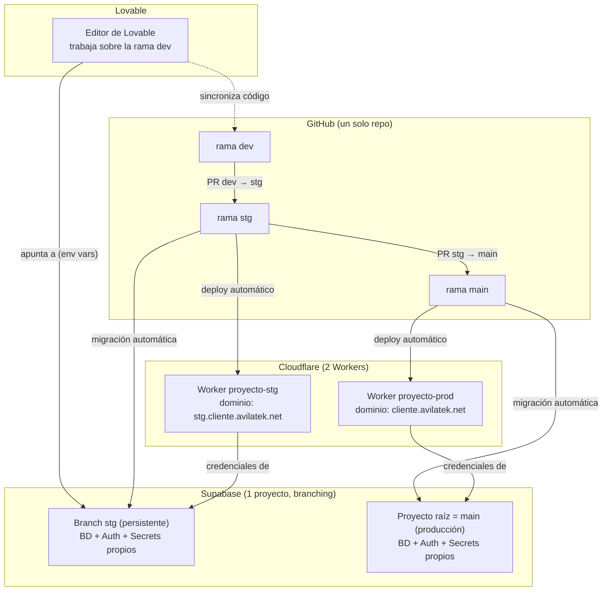

Esta sección documenta **cómo desplegamos cambios** en Landscapes.

En Landscapes **no usamos el botón Publish de Lovable para desplegar nada**, ni frontend ni backend. Lovable se usa exclusivamente para **construir y probar** — el despliegue real siempre pasa por fuera de Lovable:

- El **backend** (base de datos, Auth, Edge Functions) vive en un **proyecto de Supabase externo**, con branching de `main` (producción) y `stg` (staging).
- El **frontend** se despliega en **Cloudflare**, con un deploy automático disparado por Pull Requests contra el repo de GitHub.
- En Lovable se trabaja siempre sobre una tercera rama, **`dev`**, que no tiene infraestructura propia: apunta a la base de datos de `stg` y no se despliega directo a ningún lado (ver [Manejo de ramas](/docs/lovable-setup/branch-management)). Los despliegues ocurren al mergear `dev → stg` y `stg → main`.

No hay “varios pipelines para elegir” como en un setup anterior: este es **el único flujo** que usamos para todos los proyectos nuevos.

> **Importante:** el acceso a Supabase y Cloudflare (organización/cuenta) se gestiona a través de tu **supervisor**, igual que el acceso a Lovable y GitHub.

## Mapa completo: ramas, Cloudflare, Supabase y Lovable

Puntos clave del diagrama:

- **`dev` no tiene infraestructura propia**: Lovable trabaja ahí, pero la app (mientras se prueba en Lovable) apunta a la base de datos del branch `stg` de Supabase.
- **Cada Pull Request dispara dos cosas en paralelo**: un deploy en Cloudflare y (si hay migraciones) una actualización de la base de datos en Supabase, ambos hacia el mismo ambiente (`stg` o `main` según el PR).
- **Los Edge Functions no están en este diagrama** porque no se despliegan solos con el merge — es un paso manual aparte (ver [Setup de Supabase](/docs/lovable-setup/supabase-setup)).
- Nunca hay un tercer ambiente de base de datos para `dev`: solo existen `main` y `stg` como branches reales de Supabase.
- **Lovable nunca toca `main`**: si se usa el conector nativo de Lovable↔Supabase (dentro del editor), se conecta únicamente a `stg` — nunca a producción.

## Guías de esta sección

> El setup del backend (proyecto de Supabase + branching `main`/`stg`) se documenta aparte, en [Setup de Supabase](/docs/lovable-setup/supabase-setup) (sección Setup de Lovable) — se hace justo después de definir el manejo de ramas del repo.

1. [Deploy del frontend en Cloudflare](/docs/lovable-ops/cloudflare-deploy) — crear los dos proyectos de Cloudflare Workers (uno por rama) y conectarlos al repo.
2. [Configurar el dominio](/docs/lovable-ops/custom-domain) — asignar el dominio de producción y el de staging a cada Worker.
3. [Flujo de release día a día](/docs/lovable-ops/release-flow) — cómo se libera un cambio de `stg` a `main` y qué verificar.
4. [Deploy rápido de un HTML suelto](/docs/lovable-ops/quick-html-deploy) — flujo aparte (Direct Upload) para publicar un HTML o prototipo sin repo ni build.

El setup de las guías 1-2 se hace **una sola vez por proyecto** (al arrancarlo). La guía 3 es la que se repite en cada release. La guía 4 es un caso especial, independiente del flujo normal.

---

## Documentación oficial

Cada guía de esta sección enlaza al final la documentación oficial específica del tema que cubre. Como referencia general:

- Lovable — [Documentación oficial](https://docs.lovable.dev/)
- Supabase — [Documentación oficial](https://supabase.com/docs)
- Cloudflare Workers — [Documentación oficial](https://developers.cloudflare.com/workers/)
